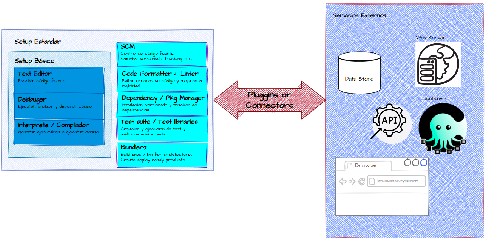

# Entorno de desarrollo
tags: #dsw 
Para desarrollar cualquier tipo software y en cualquier lenguaje de programación son necesarias muchas herramientas, como mínimo:
* Editor de código
* Depurador
* Intérprete o compilador

En la actualidad se han sumado a estas herramientas básicas otras que son consideradas esenciales para desarrollar hoy en día aplicando buenas prácticas:
* Test suit
* Formateadores de código
* Linters
* Gestores de dependencias y paquetes
* Bundlers
* Source Control Management (SCM)

Dependiendo de que software se esté desarrollado también pueden ser necesario interactuar con otras herramientas y servicios que son utilizadas durante el desarrollo. Siendo las más frecuentes:
* Bases de datos
* Navegadores web
* Web Servers
* Containers
* APIs externas

Y otras herramientas pueden incluso ser necesarias para el desarrollo de aplicaciones especializadas como por ejemplo IA, Data Science y Gaming

En resumen un entorno de desarrollo es el conjunto de herramientas que necesita un desarrollador durante el proceso de Desarrollo de Software. 



## Editor de código
Entre las herramientas que se utilizan para el desarrollo, la principal es el editor de código ya que es la herramienta con la que el desarrollador realizará la mayor parte del trabajo. 

Sin embargo solo la edición de código fuente no es suficiente para realizar el desarrollo de software. Se requiere compilar y/o ejecutar el código para poder realizar pruebas. Y diversas formas de depurar errores.

## IDE
Aunque es posible desarrollar software utilizando un editor de código y otras aplicaciones independientes para realizar y realizar la depuración, compilación/ejecución, testing, formatear y demás actividades fundamentales  (y de hecho fue la forma más usada durante mucho tiempo), en líneas generales esto ya no se considera eficiente. Sea que se mida como el tiempo insumido por el desarrollador o en el consumo de recursos de los equipos informáticos.

De esta forma estas herramientas empezaron a integrarse al editor de código. Surgiendo así los IDE o "Integrated Development Environment", que permitían realizar todas las tareas relativas al desarrollo de software sin salir de la aplicación. Existían algunos propietarios donde todas las integraciones estaban realizada por la empresa fabricante y otros abiertos donde se podían construir pluggins de forma independiente.

La desventaja de estos entornos es que para cubrir las necesidades de la mayoría de los desarrolladores estos contaban con más herramientas de las utilizadas por la mayoría, consumiendo muchos recursos de los equipos informáticos de forma innecesaria.

También aparecieron editores de código que soportan pluggins, extensiones o add-ons para realizar estas tareas. Que permitían un grado de personalización de acuerdo a las necesidades de trabajo de cada desarrollador.

Más adelante la aparición de editores que permitían desarrollar pluggins utilizando html, css y javascript acompañado por un catálogo oficial de extensiones empezaron a hacer más popular esta estrategia.


| |Ventajas|Desventajas|
|---|:---|---|
|IDE|\* Pueden utilizarse apenas termina su instalación con mínima o 0 customización<br><br>\* Las integraciones funcionan muy bien|\* Utilizan muchos recursos<br><br>\* Difíciles de adaptar a todas las necesidades<br><br>\* Manejan un conjunto pequeño de lenguajes|
|Code Editor<br>+ pluggins|\* Mejor performance<br><br>\* Customizado a las necesidades y fácilmente adaptables | \* Requiere instalación de extensiones<br><br>\* Requieren configuración |

La ventaja de un IDE es que luego de instalarlo pueden ser utilizados para desarrollar en el/los lenguajes para los que están preparados sin necesidad de customizar nada (o con una mínima customización). La desventaja es su consumo de recursos y a veces la imposibilidad de adaptarlos a necesidades específicas. Mientras que los editores de código con pluggins pueden ser más eficientes en términos de performance, requieren instalar extensiones y algún grado de customización para su uso.

En general la elección depende de las preferencias del desarrollador/equipo de desarrollo y aunque se pueden utilizar distintas alternativas la dificultad de ello varía según el lenguaje y los entornos de desarrollo utilizados.

## Opciones y recomendaciones de la cátedra

A continuación podrá encontrar los links a las herramientas más  comunes para las tecnologías que utilizaremos en la cátedra.

* [VS Code](https://code.visualstudio.com) / [Codium](https://vscodium.com)
* [WebStorm](https://www.jetbrains.com/webstorm/) (es un producto pago pero mediante la cuenta de email de la universidad se puede obtener licencias anuales gratuitas)
* [Neovim](https://neovim.io) / [Vim](https://www.vim.org)
* [Fleet](https://www.jetbrains.com/fleet/)
* Otros: [Lapce](lapce.dev/) (pre-alpha), [Sublime](http://www.sublimetext.com), etc

En DSW no requerimos el uso de ninguna herramienta en especial, pero la mayoría de los ejemplos serán utilizando **VS Code** o en caso de preferirlo su alternativa 100% OSS y sin telemetría **Codium**.

**Nota sobre extensiones en Codium**: quienes prefieran utilizar Codium, esta alternativa tiene su propia Extensions Gallery pero en caso de que alguna de VS Code no esté disponible y deseen utilizar la de VS Code pueden agregar a este la galería de VS Code anexando la siguiente configuración en el product.json
```json
// ~$ cat ~/.config/VSCodium/product.json 
{
  "extensionsGallery": {
    "serviceUrl": "https://marketplace.visualstudio.com/_apis/public/gallery",
    "cacheUrl": "https://vscode.blob.core.windows.net/gallery/index",
    "itemUrl": "https://marketplace.visualstudio.com/items",
    "controlUrl": "",
    "recommendationsUrl": ""
  }
}

```

### Configuración base recomendada

A continuación recomendaremos varias extensiones y configuraciones base para VS Code/Codium que utilizaremos durante el desarrollo (como typescript y configuración del debugger, formateadores, etc). Más adelante a medida que sea necesario se sugerirán configuraciones avanzadas relacionadas al tema específico que estemos desarrollando.

Quienes prefieran utilizar otra herramienta pueden hacerlo per deberán indagar alternativas para cada extensión (si la herramienta no cuenta ya con la funcionalidad) y deberán investigar las configuraciones necesarias para lograr los mismos objetivos. Por ejemplo en Webstorm tiene su propio chequeo de tipos para TypeScript o puede integrarse con TypeScript Language Service para ello y cuenta con otras forma de configurar el debugging.

### Extensiones
Comenzaremos por instalar al menos las siguientes extensiones en el editor:

* [Prettier](https://marketplace.visualstudio.com/items?itemName=esbenp.prettier-vscode)
* [ESLint](https://marketplace.visualstudio.com/items?itemName=dbaeumer.vscode-eslint)
* [SQLite](https://marketplace.visualstudio.com/items?itemName=alexcvzz.vscode-sqlite)
* [SQLTools](https://marketplace.visualstudio.com/items?itemName=mtxr.sqltools)
* [REST Client](https://marketplace.visualstudio.com/items?itemName=humao.rest-client)
* [Live Server](https://marketplace.visualstudio.com/items?itemName=ritwickdey.LiveServer)

### Configuraciones
Se recomiendan además modificar las siguientes settings:
```json
{
  "editor.tabSize": 2,
  "editor.linkedEditing": true,
  "editor.formatOnPaste": true,
  "editor.formatOnSave": true,
  "prettier.singleQuote": true,  
}
```

Más adelante se sugerirán más configuraciones a medida que sean necesarias para cada tema.