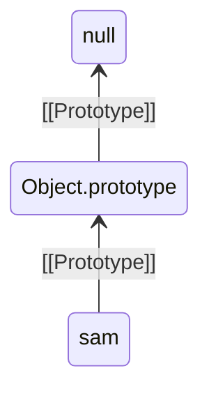
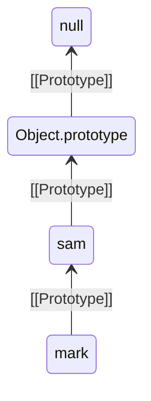
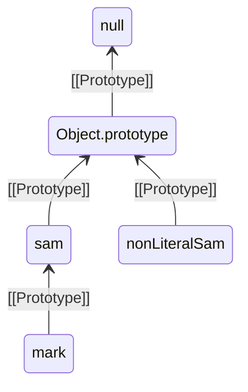
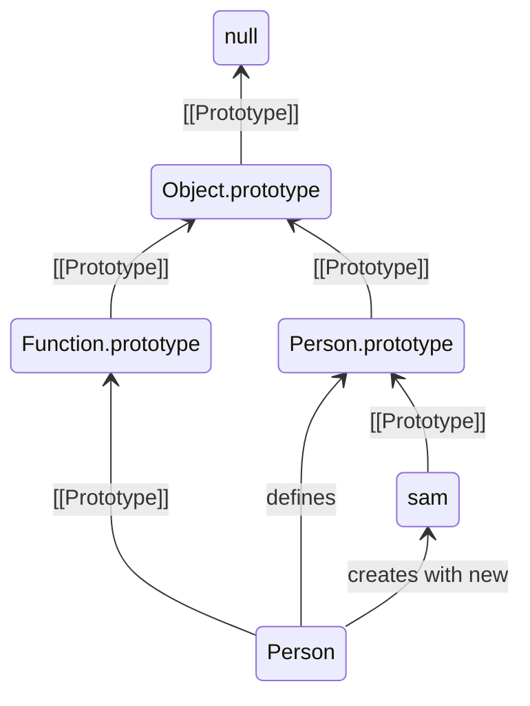
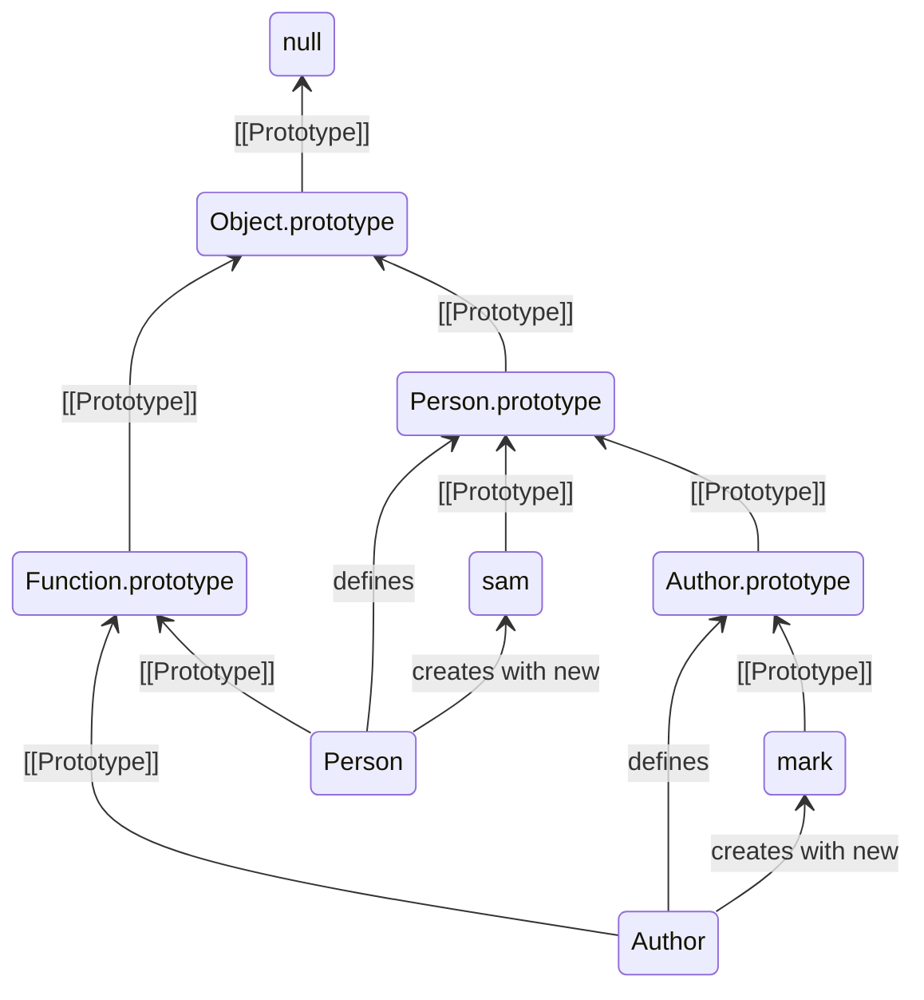
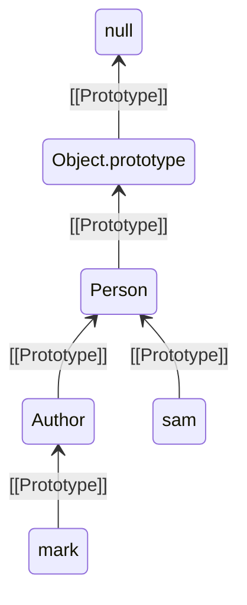

# JavaScript Objects
tags: #dsw #js #object

## Objetos

### ¿Qué son objetos en JS?
Los objetos en JS son un tipo de dato fundamental que permite almacenar entidades complejas. Permite de forma conjunta almacenar datos (variables) y funcionalidad (funciones); en la POO las variables y funciones son llamadas propiedades y métodos respectivamente.

Las propiedades son pares clave-valor donde la clave es un identificador (de tipo string) único dentro del objeto y el valor es cualquier construcción válida de JS incluyendo colecciones u otros objetos. 

### Propiedades

ejemplo:
```javascript
const person = {
  firstName: 'Someone',
  lastName: 'Random',
  age: 30,
  hobbies: ['reading', 'surfing', 'coding'],
  address: {
    street: '123 Mountain view st',
    city: {
	    zip: 816015,
	    name: 'Kunlun'
    },
    state: {
	    code: 63, 
	    name: 'Qinghai province'
	    },
    country: 'China'
  }
};

```

En este ejemplo hemos definido un objeto literal con las propiedades:
* firstName, lastName y age: valores atómicos de tipo string, string y number respectivamente.
* hobbies: es un array de string.
* address: un objeto que a su vez tiene otras propiedades (y objetos internos)

#### Uso
En JS hay dos formas de acceder a las propiedades: notación punto o corchete.

Con la notación punto se utiliza un punto para conectar el objeto con la propiedad y con la notación corchete se indican las propiedades como se accede a un array y la clave es un string con el nombre de la propiedad.

ejemplo:
```javascript
const person = {
  firstName: 'Someone',
  lastName: 'Random',
  age: 30,
  hobbies: ['reading', 'surfing', 'coding'],
  address: {
    street: '123 Mountain view st',
    city: {
      zip: 816015,
      name: 'Kunlun',
    },
    state: {
      code: 63,
      name: 'Qinghai province',
    },
    country: 'China',
  },
};

console.log('dot notation');
console.log(`${person.firstName} lives in ${person.address.city.name}, and is ${person.age}`);

console.log('change age');
person.age = 31;
console.log(`${person.firstName} lives in ${person.address.city.name}, and is ${person.age}`);

console.log('bracket notation');
person['age'] = 40;
console.log(`${person['firstName']} lives in ${person['address']['city']['name']}, and is ${person['age']}`);
```

Salida:
```bash
$ node 03.01-objectsProperties.js 
dot notation
Someone lives in Kunlun, and is 30
change age
Someone lives in Kunlun, and is 31
bracket notation
Someone lives in Kunlun, and is 40
```

#### Nuevas propiedades
Además de crear objetos con propiedades de forma literal se pueden agregar nuevas propiedades de forma dinámica:
```javascript
console.log('create properties');
person.job = 'developer';
console.log(
  `${person['firstName']} lives in ${person['address']['city']['name']}, is ${person['age']} and works as a ${person.job}`
);
```

Salida:
```bash
create properties
Someone lives in Kunlun, is 40 and works as a developer
```


### Métodos
A diferencia de las propiedades que solo contienen datos , los métodos permiten modelar comportamiento. Son funciones que se definen de manera similar a las propiedades y son ejecutados al invocar a la key seguida de (). Los paréntesis pueden tener dentro cero, uno o más parámetros

Ejemplo:
```javascript
const person = {
  firstName: 'Someone',
  lastName: 'Random',
  birthDate: new Date('1993-01-10'),
  getAge() {
    return Math.floor((new Date() - this.birthDate.getTime()) / 3.15576e10);
  },
  getAgeToDate(someDate) {
    return Math.floor((someDate - this.birthDate.getTime()) / 3.15576e10);
  },
  hobbies: ['reading', 'surfing', 'coding'],
  address: {
    street: '123 Mountain view st',
    city: {
      zip: 816015,
      name: 'Kunlun',
    },
    state: {
      code: 63,
      name: 'Qinghai province',
    },
    country: 'China',
    getFullAddress() {
      return `${this.street}, ${this.city.name}, ${this.state.name},${this.country}`;
    },
  },
};

console.log(person.address.getFullAddress());
console.log(person.getAge());
console.log(person.getAgeToDate(new Date('2020-01-01')));
```

Salida
```bash
$ node 02.02-objectMethods.js 
123 Mountain view st, Kunlun, Qinghai province,China
30
26
```

_Nota_: Los métodos pueden definirse de dos formas, con function o con la forma acortada que vimos más arriba (también conocida como shorthand).

Por ejemplo el método `getFullAddress` se puede definir de estas dos formas:
```javascript
//function declaration
getAge: function () {
	return Math.floor((new Date() - this.birthDate.getTime()) / 3.15576e10);
}

//shorthand alternative
getAge() {
	return Math.floor((new Date() - this.birthDate.getTime()) / 3.15576e10);

```

Como se indicó en la sección de funciones las arrow functions no deben usarse para métodos

### Disculpe, estoy buscando la Clase de este objeto....

Hasta ahora hemos creado un objeto literal con propiedades, hemos agregado nuevas propiedades y hemos definido e ínvocado métodos...pero no hemos definido ninguna clase ni nada que se le parezca. ¿Los objetos no se crean a partir de una clase? ¿Dónde están las clases?


En la POO tradicional los objetos se crean a partir de clases pero en JS esto no es necesario. En JS existe algo llamado prototipos y herencia prototípica (que mencionaremos más en detalle luego). Donde un objeto en lugar de referenciar a una clase lo hace a un prototipo que no es más que otro objeto.

Es decir que los objetos no tienen clases en JS.

**Disclaimer**: En versiones más recientes de JS se agregó nueva sintaxis para definir clases y herencia de la forma tradicional de POO. Pero estas clases en realidad no son más que funciones que como ya sabemos son otros objetos en JS (objetos función) pero de esto hablaremos más adelante.

## Prototype
Como mencionamos los objetos de JS no necesitan clases, en su lugar CADA objeto de JS hereda sus métodos y propiedades de un prototype que puede ser cualquier otro objeto de JS.

A su vez un prototype puede tener su propio prototype del cual hereda formando lo que se llama prototype chain.

Es decir que en JS los objetos heredan de objetos. Para lograr esto cada objeto al crearse cuenta con una referencia a su prototype que puede ser modificado (aunque no se recomienda).

Así cuando en un objeto un método o propiedad son invocados JS busca dicha propiedad o método en el propio objeto, si lo encuentra lo accede; pero si no lo encuentra en el objeto continúa buscándolo en su prototype. Si lo encuentra lo utiliza y si no continúa la búsqueda en el prototype del prototype y así sucesivamente por la prototype chain hasta que lo encuentra o llega al primer prototype de la cadena.

La asignación del prototype depende de método de construcción del objeto y puede ser cambiado después aunque no es considerado una buena práctica en general.

### \_\_proto\_\_ vs prototype

Se debe distinguir una diferencia entre las propiedades `__proto__` y `prototype` que suele causar confusiones y errores.

La propiedad `prototype` de por ejemplo `Object.prototype` es el prototype que se asigna a todos los nuevos objetos.

Mientas que `__proto__` apunta al prototype del elemento en el que se invoca por ejemplo `someObject.__proto__`

*Nota*: según las especificación de ECMAScript la forma correcta de acceder al prototype de un objeto es mediante `Object.getPrototypeOf` y `Object.setPrototypeOf` en lugar de `__proto __` sin embargo aquí utilizaremos `__proto__` ya que es más corto y simplifica la lectura de los ejemplos.

### Lectura extra sobre prototype
Al finalizar esta sección de objetos se recomienda leer detenidamente la documentación de MDN de [prototype](https://developer.mozilla.org/en-US/docs/Learn/JavaScript/Objects/Object_prototypes);  además del concepto principal se explican otros temas fundamentales como "shadowing properties" y métodos base de JS que permiten manipular directamente la cadena de prototipos o preguntar sobre las propiedades propias y de los prototipos.

## Construir objetos
A continuación vamos a a ver formas tradicionales de crear objetos en JS.

### Literals Object
Al principio mostramos una forma de crear un objeto especificando sus propiedades y métodos y almacenándolo en una variable. Esto se conoce como objetos literales.

En este caso cada objeto se debe escribir entero.

Ejemplo:
```javascript
'use strict';

const sam = {
  firstName: 'Sam',
  lastName: 'Clemens',
  age: 25,
  greet() {
    return `Hello, I'm ${this.firstName} ${this.lastName}`;
  },
};

console.log(`${sam.firstName} says:\n${sam.greet()}`);

console.log(`sam's prototype is:${JSON.stringify(sam.__proto__)}`);

console.log(Object.prototype == sam.__proto__);

console.log(`the prototype of the prototype of sam is:${JSON.stringify(sam.__proto__.__proto__)}`);
```

Salida:
```bash
$ node 03.03-literals.js 
Sam says:
Hello, I\'m Sam Clemens
sam\'s prototype is:{}
true
the prototype of the prototype of sam is:null
```

Es decir que cuando construimos un objeto literal se le asigna por defecto un prototype que es `Object.prototype`.

#### Prototype chain


#### Asignando otro prototype

Sin embargo podemos estructurar una herencia a través de la propiedad `__proto__`, aunque no es algo común.

Ejemplo:
```javascript
'use strict';

const sam = {
  firstName: 'Sam',
  lastName: 'Clemens',
  age: 25,
  greet() {
    return `Hello, I'm ${this.firstName} ${this.lastName}`;
  },
};

const mark = {
  firstName: 'Mark',
  lastName: 'Twain',
  quote: 'Never argue with stupid people, they will drag you down to their level and then beat you with experience.',
  sayQuote() {
    return `"${this.quote}". ${this.firstName} ${this.lastName}`;
  },
  __proto__: sam,
};

console.log(`${sam.firstName} says:\n${sam.greet()}`);
console.log();

console.log(`${mark.firstName} greets:\n${mark.greet()}\nand says:${mark.sayQuote()}`);
console.log();

console.log(`sam's prototype is:${JSON.stringify(sam.__proto__)}`);
console.log(`mark's prototype is:${JSON.stringify(mark.__proto__)}`);

console.log(`mark.__proto__ is sam? ${sam === mark.__proto__}`);
console.log(`the prototype of the prototype of mark is:${JSON.stringify(mark.__proto__.__proto__)}`);
console.log(
  `the prototype of the prototype of the prototype of mark is:${JSON.stringify(mark.__proto__.__proto__.__proto__)}`
);
```

Salida:
```bash
$ node 03.04-literalsPrototype.js 
Sam says:
Hello, I\'m Sam Clemens

Mark greets:
Hello, I\'m Mark Twain
and says:"Never argue with stupid people, they will drag you down to their level and then beat you with experience.". Mark Twain

sam\'s prototype is:{}
mark\'s prototype is:{"firstName":"Sam","lastName":"Clemens","age":25}
mark.__proto__ is sam? true
the prototype of the prototype of mark is:{}
the prototype of the prototype of the prototype of mark is:null
```

En este caso asignamos a sam como prototype de mark al momento de crearlo.

En este caso al redefinir firstName y lastName en mark al invocarlos devuelve los valores de mark. Aún al ejecutar la función greet que está definida en sam utiliza los valores del objeto. Esto es porque sin importar donde se los invoca los métodos o propiedades JS tratan de ejecutar el código con los valores de las propiedades definidos en el objeto y sólo cuando no los encuentra allí entonces continua con el prototype y si allí no los encontrara continuará con el prototype de este y así sucesivamente por la prototype chain hasta encontrarlos o llegar a null donde fallará.

#### Limitaciones

Ya mencionamos entonces que en JS los objetos no necesitan una clase y creamos un objeto literal, es decir especificando cada una de sus propiedades y métodos, tanto la key como los valores.

Aunque esto nos da una flexibilidad total y muchas veces resulta conveniente, hacerlo así siempre puede ser tedioso en algunos casos o peor aún error prone. 

Por ello existen otras formas de "construir objetos" en base a una definición.

#### Prototype chain


### Object.create

Además de utilizar la propiedad `__proto__` para definir un prototipo podemos usar `Object.create`. 

Aquí especificamos el objecto que utilizaremos como prototype y luego las propiedades que quisiéramos modificar.

Ejemplo:
```javascript
const sam = {
  firstName: 'Sam',
  lastName: 'Clemens',
  age: 25,
  greet() {
    return `Hello, I'm ${this.firstName} ${this.lastName}`;
  },
};

const mark = Object.create(sam, {
  firstName: { value: 'Mark' },
  lastName: { value: 'Twain' },
});

console.log(`${sam.firstName} says:\n${sam.greet()}`);
console.log(`${mark.firstName} says:\n${mark.greet()}`);

console.log();
console.log(`mark's prototype is:${JSON.stringify(mark.__proto__)}`);
console.log(sam == mark.__proto__);

console.log(`the prototype of the prototype of mark is:${JSON.stringify(mark.__proto__.__proto__)}`);
console.log(
  `the prototype of the prototype of the prototype of literal is:${JSON.stringify(mark.__proto__.__proto__.__proto__)}`
);
```

Salida:
```bash
$ node 03.05-Object.create.js 
Sam says:
Hello, I\'m Sam Clemens
Mark says:
Hello, I\'m Mark Twain

mark\'s prototype is:{"firstName":"Sam","lastName":"Clemens","age":25}
true
the prototype of the prototype of mark is:{}
the prototype of the prototype of the prototype of literal is:null
Non-literal Sam says:
Hello, I\'m Non-literal Sam Clemens
```


Del ejemplo anterior vemos que el resultado es equivalente al usado en el ejemplo anterior utilizando objetos literales.

Si quisiéramos crear el primer objeto sam con `Object.create` deberíamos utilizar el objeto `{}` como prototype:
```javascript
const nonLiteralSam = Object.create(
  {},
  {
    firstName: { value: 'Sam' },
    lastName: { value: 'Clemens' },
    age: { value: 25 },
    greet: {
      value: function () {
        return `Hello, I'm ${this.firstName} ${this.lastName}`;
      },
    },
  }
);

console.log(`${nonLiteralSam.firstName} says:\n${nonLiteralSam.greet()}`);
```

Salida:
```bash
Non-literal Sam says:
Hello, I\'m Non-literal Sam Clemens
```

Como se ve tanto en un objeto simple o heredando de otro, definirlo completamente a través del `Object.create` es tedioso y un poco más complejo. Pero permite definir características adicionales a las propiedades como writable, enumerable, configurable, etc; para mayor información pueden continuar en la documentación de MDN de [`Object.create`](https://developer.mozilla.org/en-US/docs/Web/JavaScript/Reference/Global_Objects/Object/create)

#### Prototype chain


### Constructor Functions

La idea base sobre una función constructora es crear un objeto a partir de una función que especifica los parámetros que debe recibir el nuevo objeto y devuelve un objeto creado a partir de ejecutar dicha función.

*Nota*: Hay algunas situaciones particulares que pueden revisar en la documentación del operador [`new`](https://developer.mozilla.org/en-US/docs/Web/JavaScript/Reference/Operators/new).

Antes de que existiera la sintaxis de clases en JS la forma más utilizada para crear objetos en base a una plantilla eran las funciones constructoras:
```javascript
'use strict';

function Person(firstName, lastName, age) {
  this.firstName = firstName;
  this.lastName = lastName;
  this.age = age;
}

Person.prototype.greet = function () {
  return `Hello, I'm ${this.firstName} ${this.lastName}`;
};

const sam = new Person('Sam', 'Clemens', 25);

console.log(`${sam.firstName} says:\n${sam.greet()}`);
console.log();
console.log("object's prototype");
console.log(`sam.__proto__ is Person? ${sam.__proto__ === Person}`);
console.log(`sam.__proto__ is Person.__proto__? ${sam.__proto__ === Person.__proto__}`);
console.log(`sam.__proto__ is Person.prototype? ${sam.__proto__ === Person.prototype}`);

console.log();
console.log('Persons prototype');
console.log(`Person.__proto__ is Person.prototype? ${Person.__proto__ === Person.prototype}`);
console.log(`Person.__proto__ is Function.prototype? ${Person.__proto__ === Function.prototype}`);
console.log(`Person.prototype is Object.prototype? ${Person.prototype === Object.prototype}`);
console.log(`Person.prototype.__proto__ is Object.prototype? ${Person.prototype.__proto__ === Object.prototype}`);
```

Salida:
```javascript
$ node 03.06-constructorFunctions.js 
Sam says:
Hello, I\'m Sam Clemens

object\'s prototype
sam.__proto__ is Person? false
sam.__proto__ is Person.__proto__? false
sam.__proto__ is Person.prototype? true

Persons prototype
Person.__proto__ is Person.prototype? false
Person.__proto__ is Function.prototype? true
Person.prototype is Object.prototype? false
Person.prototype.__proto__ is Object.prototype? true
```

Gráficamente:


#### Prototype de la función y los objetos creados

Uno de los temas más difíciles de comprenden con las funciones constructoras es la prototype chain.

La principal razón de esto es que a diferencia de la herencia tradicional hay una cadena de herencia completamente diferente entre las funciones constructoras y los objetos construidos.

Las funciones constructoras tienen como prototype a Function.prototype es decir al prototype genérico de todas las funciones.

Sin embargo el objeto creado (sam en el ejemplo) tiene como prototype a otro objeto: Person.prototype.

Las funciones constructoras crea un nuevo objeto prototype (que llamaremos `prototipo asignable`) que a su vez tienen a Object.prototype como prototype; y cuando se le pide un nuevo objeto con `new` lo crean con el `prototipo asignable`.

Muchos comenten el error al principio que los objetos creados por una función constructora "heredan" o más bien tienen de prototype a la función constructora que los crea. Sin embargo esto sería un problema ya que el objeto creado "heredaría" de una función cuando debería heredar de object.

#### Herencia entre funciones constructoras
Implementar herencia entre objetos es simple mediante prototypes pero hacer lo mismo con funciones constructoras es un poco más complejo ya que debe tenerse en cuenta no solo el prototype que tiene la función si no el prototipo asignable para los objetos que crea.

```javascript
'use strict';

function Person(firstName, lastName, age) {
  this.firstName = firstName;
  this.lastName = lastName;
  this.age = age;
}

Person.prototype.greet = function () {
  return `Hello, I'm ${this.firstName} ${this.lastName}`;
};

function Author(firstName, lastName, age, quote) {
  Person.call(this, firstName, lastName, age);
  this.quote = quote;
}

Author.prototype = Object.create(Person.prototype);
Author.prototype.constructor = Author;

Author.prototype.sayQuote = function () {
  return `"${this.quote}". ${this.firstName} ${this.lastName}`;
};

const sam = new Person('Sam', 'Clemens', 25);
const mark = new Author(
  'Mark',
  'Twain',
  25,
  'Never argue with stupid people, they will drag you down to their level and then beat you with experience.'
);

console.log(`${sam.firstName} says:\n${sam.greet()}`);
console.log();
console.log(`${mark.firstName} greets:\n${mark.greet()}\nand says:${mark.sayQuote()}`);

console.log();
console.log("object's prototype");
console.log(`mark.__proto__ is Author.prototype? ${mark.__proto__ === Author.prototype}`);
console.log(`mark.__proto__.__proto__ is Person.prototype? ${mark.__proto__.__proto__ === Person.prototype}`);
console.log(`mark.__proto__.__proto__ is sam.__proto__? ${mark.__proto__.__proto__ === sam.__proto__}`);

console.log();
console.log(`Author._proto_ is Person? ${Author.__proto__ === Person}`);
console.log(`Author._proto_.__proto__ is Person? ${Author.__proto__.__proto__ === Person}`);
console.log(`Author._proto_ is Function.prototype? ${Author.__proto__ === Function.prototype}`);

console.log(`Author._proto_ is Person.__proto__? ${Author.__proto__ === Person.__proto__}`);
console.log(`Author.prototype.__proto__ is Person.prototype? ${Author.prototype.__proto__ === Person.prototype}`);
```

Salida:
```bash
$ node 03.07-constructorFunctionsInheritance.js 
Sam says:
Hello, I\'m Sam Clemens

Mark greets:
Hello, I\'m Mark Twain
and says:"Never argue with stupid people, they will drag you down to their level and then beat you with experience.". Mark Twain

object\'s prototype
mark.__proto__ is Author.prototype? true
mark.__proto__.__proto__ is Person.prototype? true
mark.__proto__.__proto__ is sam.__proto__? true
Author._proto_ is Person? false
Author._proto_.__proto__ is Person? false
Author._proto_ is Function.prototype? true
Author._proto_ is Person.__proto__? true
Author.prototype.__proto__ is Person.prototype? true
```

Gráficamente:


Ya vemos que crear una herencia entre funciones constructoras requiere mucho más esfuerzo, debemos invocar a la función "Padre", utilizar Object.crate para crear el prototipo asignable de la subclase, reemplazar la función constructora del prototype.

Además de esto la prototype chain es poco intuitiva:
* El `__proto__` de Author no es Person si no Function.prototype.
* La relación entre Author y Person es que el prototype de Author.prototype es Person.prototype es decír el prototipo asignable de Person es el prototype del prototipo asignable de Author

Lo que si resulta intuitivo es: 
* `mark.__proto__.`es `Author.prototype`
* `mark.__proto__.__proto__`es `Person.prototype`

Lo que produce el resultado esperado de la herencia tradicional.

La herencia prototipada es mucho más flexible y amplia que la herencia de la POO tradicional, se demuestra viendo como puede lograrse el mismo resultado. Sin embargo el proceso es más complejo y tedioso. Para resolver este inconveniente se ha desarrollado una sintaxis más moderna para crear clases que simplifica el proceso. Logra el mismo resultado y oculta la complejidad que aquí mostramos.


### Object constructors

Los Object constructors son un tipo de función utilizada para crear objetos con una estructura y comportamiento compartidos.

A diferencia de una función constructora los constructores de objetos no utilizan `new` y operan directamente sobre el objeto utilizando `this`.

La creación se sigue realizando mediante el Object.create.

Ejemplo:
```javascript
'use strict';

const Person = {
  init(firstName, lastName, age) {
    this.firstName = firstName;
    this.lastName = lastName;
    this.age = age;
    this.greet = function () {
      return `Hello, I'm ${this.firstName} ${this.lastName}`;
    };
  },
};

const Author = {
  __proto__: Person, // can be done with Object.create as well
  init(firstName, lastName, age, quote) {
    Person.init.call(this, firstName, lastName, age); 
    this.quote = quote;
    this.sayQuote = function () {
      return `"${this.quote}". ${this.firstName} ${this.lastName}`;
    };
  },
};

const sam = Object.create(Person);
sam.init('Sam', 'Clemens', 25);

const mark = Object.create(Author);
mark.init(
  'Mark',
  'Twain',
  25,
  'Never argue with stupid people, they will drag you down to their level and then beat you with experience.'
);

console.log(`${sam.firstName} says:\n${sam.greet()}`);
console.log();
console.log(`${mark.firstName} greets:\n${mark.greet()}\nand says:${mark.sayQuote()}`);
console.log();

console.log(`sam.__proto__ is Person? ${sam.__proto__ === Person}`);
console.log(`Person.__proto__ is Object.prototype? ${Person.__proto__ === Object.prototype}`);
console.log(`Person.prototype: ${Person.prototype}`);

console.log(`mark.__proto__ is Author? ${mark.__proto__ === Author}`);
console.log(`mark.__proto__.__proto__ is Person? ${mark.__proto__.__proto__ === Person}`);
console.log(`Author.__proto__ is Person: ${Author.__proto__ === Person}`);

```

Salida:
```bash
$ node 03.08-objectConstructors.js 
Sam says:
Hello, I\'m Sam Clemens

Mark greets:
Hello, I\'m Mark Twain
and says:"Never argue with stupid people, they will drag you down to their level and then beat you with experience.". Mark Twain

sam.__proto__ is Person? true
Person.__proto__ is Object.prototype? true
Person.prototype: undefined
mark.__proto__ is Author? true
mark.__proto__.__proto__ is Person? true
Author.__proto__ is Person: true
```

Gráficamente:


Como se puede ver en el ejemplo anterior tanto Person como Author son objetos en lugar de funciones. Como ahora son objetos podemos incluirlos en la prototype chain. Aunque no es considerado una de las formas standard de creación de objetos en JS es usada porque:
* Pueden utilizarse para construir jerarquías muy complejas pero mucho de forma mucho más simple que las funciones constructoras.
* Aunque no es muy respetuoso de la herencia tradicional de POO es muy intuitiva y fácil de implementar.

Las desventajas son que deben usar algunos métodos que no son tan directos `Object.create` en lugar de new. También en la herencia debe establecerse la superclase como prototype de la subclase y debe utilizarse el `SuperClass.init.call(this,...)` para utilizar el constructor de la superclase. Aunque es un más simple que reasignar el `SubClass.prototype.constructor` y las funciones no deben definirse en el prototype de la función constructora.

En esencia, los constructores de objetos son una forma muchísimo más simple de simular "clases" y herencia que las funciones constructoras y mucho más estructurada que utilizar literales.

Sin embargo actualmente se encuentran en desuso debido a que la nueva sintaxis de `class` de JS es incluso más simple y respeta tanto el mecanismo de herencia tradicional de la POO y lo esperable de la prototype chain.

### Object Factory

Una object factory es una función que crea un objeto en base a los parámetros y lo devuelve.

Ejemplo:
```javascript
'use strict';

function createPerson(firstName, lastName, age) {
  return {
    firstName,
    lastName,
    age,
    greet() {
      return `Hello, I'm ${this.firstName} ${this.lastName}`;
    },
  };
}

const sam = createPerson('Sam', 'Clemens', 25);
console.log(`${sam.firstName} says:\n${sam.greet()}`);
```

Salida:
```bash
$ node 03.09-objectFactory.js 
Sam says:
Hello, I\'m Sam Clemens
```

Las object factory en general crean objetos literales, aunque puede utilizar cualquier otro método.

En cuanto a la "herencia" la misma puede ser implementada de cualquiera de las formas que vimos antes.

Este tipo de creación responde a un patrón de software y en general se utiliza como una forma de encapsular la creación de objetos complejos donde incluso la implementación específica podía variar por configuraciones o por los parámetros que se les enviaban.

### Class

Actualmente en JS (desde ES6) existe una sintaxis alternativa para especificar objetos y la herencia en términos de la POO tradicional a través de la definición de clases.

Esta nueva sintaxis es básicamente conocida como "syntactic sugar" ya que no agrega funcionalidad si no que oculta la complejidad accidental del código y simplifica su escritura y comprensión.

Aunque no agrega nueva funcionalidad es muy conveniente porque es mucho más clara y concisa, oculta la complejidad de implementar la herencia tradicional a través de prototypes y Object.create.

En breve dedicaremos una sección entera a este concepto.

## JSON

JavaScript Object Notation (JSON) es un estándar de texto para representar datos basado en la sintaxis de objetos literales de JS. 

Si bien su sintaxis se basa en JS, JSON se utiliza en muchos lenguajes y servicios, especialmente para intercambiar datos en la web; donde se ha vuelto el standard de facto para interactuar entre servicios.

JSON es en esencia un string y JS provee un objeto global [JSON](https://developer.mozilla.org/en-US/docs/Web/JavaScript/Reference/Global_Objects/JSON) con los métodos necesarios para convertir de un string JSON a objetos de JS (deserialización) y viceversa (serialización).

- JSON es un string con un formato estandarizado, solo contiene propiedades, no métodos
- JSON usa comillas dobles tanto para los strings como las keys del objeto
- Un elemento de JSON puede ser string, number, array, boolean o un objeto literal de JS.
- La estructura de JSON hace que sea simple generar errores y el parseo de los mismos debería validarlos, ya sea mediante una librería o un schema.
- No soportan trailing commas.

Ejemplo:
```JSON
{
	"firstName": "Sam",
	"lastName": "Clemens",
	"age": 74,
	"job": "writter",
	"quotes": [
		"Never argue with stupid people, they will drag you down to their level and then beat you with experience.",
		"If you don’t read the newspaper, you’re uninformed. If you read the newspaper, you’re misinformed.",
		"The man who does not read has no advantage over the man who cannot read.",
		"I have never let my schooling interfere with my education",
	],
	"alias":{
		"firstName": "Mark",
		"lastName": "Twain"
	},
	"deceased": true,
	"famous": true,
	"alias": "Mark"
}
```

JSON se ha convertido en el standard de facto de intercambio de información de la web a través de muchas tecnologías. Su origen está en JS pero su uso se extiende mucho más allá. En la sección de API haremos uso extensivo de JSON para intercambiar información entre Frontend y Backend transformándolo a objetos de JS cuando sea necesario.