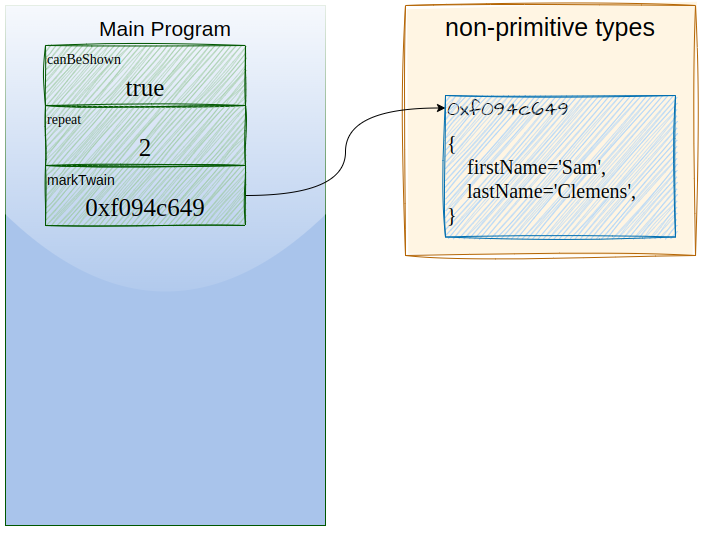
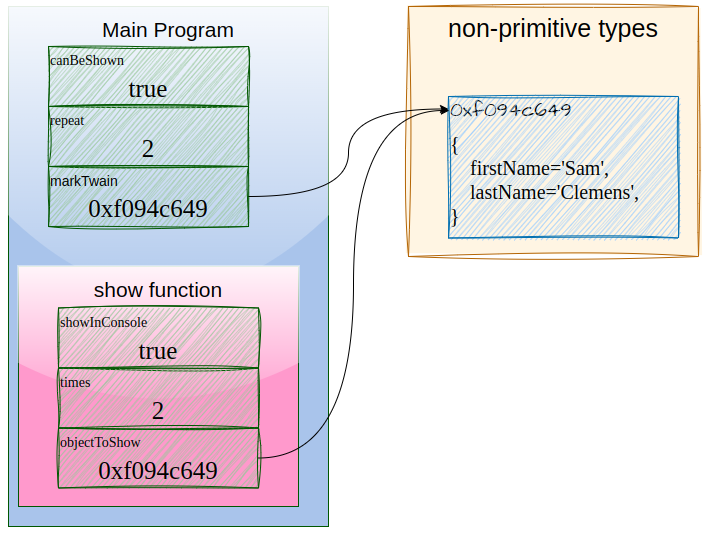

# Passing arguments

## Estrategias

Hay multiples estrategias de paso de parámetros a funciones (o métodos) que son utilizadas en múltiples lenguajes de programación. Normalmente se conocen los dos más básicos comúnmente llamados "por valor" y "por referencia".

### by Value
En el pasaje "por valor" se copia el valor de la variable pasada al parámetro de la función donde se recibe. Es decir la función se recibe una copia del valor de la variable.

De esta manera existe una nueva variable con el mismo valor pero dentro del scope de la función y desde dentro de la función no puede modificarse el valor externo de la variable original.

Este tipo de situaciones simplifican mucho el manejo y liberación automáticos de memoria.

### by Reference
En el pasaje "por referencia" el parámetro es asociado a la variable original y de esta forma no se crea una nueva variable si no que desde la función (o método) se puede acceder al contenido de la variable.

El scope de la variable excede entonces el de la función y posiblemente también el scope donde es definida. Esto generalmente dificulta mucho el manejo automático de memoria.


### by Sharing
Sin embargo hay otra estrategia utilizada en muchos lenguajes modernos: Java, Python, Ruby, JavaScript, Scheme, etc.

En este caso al almacenar un elemento complejo (como objetos, arrays y funciones) en una variable los mismos en realidad almacenan la posición de memoria del elemento complejo. 

Por lo tanto al pasar una variable como parámetro a una función, se copia su valor, como en by Value; pero su valor es en realidad una referencia a la posición de memoria del objeto.

De esta forma al modificar al utilizar este parámetro copiado que tiene una referencia a la posición de memoria nos permite modificar el objeto pasado como parámetro.

## JS
En JS hay 2 clasificaciones para los tipos de datos: [primitivos y no primitivos](02.01%20-%20sintaxis%20basica.md#Tipos). En el caso de los tipos primitivos en la variable se almacena el valor (10, 'John Doe', false, null, etc) y en el caso de los tipos no primitivos se asigna la posición de memoria.

Por ejemplo veamos el siguiente ejemplo:

```javascript
'use strict';

const canBeShown = true;
const repeat = 2;
const markTwain = {
  firstName: 'Samuel',
  lastName: 'Clemens',
};
show(canBeShown, repeat, markTwain);

function show(showInConsole, times, objectToShow) {
  if (showInConsole) {
    for (let i = 1; i <= times; i++) {
      console.log(`${i} of ${times}: ${JSON.stringify(objectToShow)}`);
    }
  }
}
```

En este caso hasta antes de invocar a la función `show` tenemos esta situación:


Donde `canBeShown` es `true` y `repeat` es `2` porque son variables de tipo primitivo mientras que la variable `markTwain`, que no contiene un dato primitivo, es una dirección de memoria donde se encuentra el objeto.

Entonces al invocar la función `show` se crea un nuevo scope con los parámetros recibidos:


Aquí se crea el nuevo scope de la función y los parámetros contienen:
* `showInConsole` una copia del valor de `canBeShown` --> `true`
* `times` una copia del valor de `repeat` --> `2`
* `objectToShow` una copia del valor de `markTwain` --> `0xf094c649`

### Ni by Value ni by Reference, by Sharing

Siempre obtiene una copia del valor pero como las variables de tipos no primitivos en JS contienen posiciones de memoria el parámetro donde se recibe permite acceder al objeto original.

Esto causa que los parámetros con tipos primitivos **NO PUEDAN** ser modificados en una función que los recibe mientras que lo parámetros con tipos no-primitivos (objetos, arrays, functions, etc.) **SI PUEDAN** modificarse dentro de la función.

Como consecuencia muchos cometen el error de decir que en JS los datos primitivos se pasan por valor mientras que los objetos son pasados por referencia.

Si bien esto ayuda a entender el concepto y puede conceptualizarse de esa forma para simplificar los cierto es que todas las variables de JS se pasan por valor pero al usar la estrategia de evaluación by sharing y la diferencia en almacenar variables primitivas o complejas JS tiene un comportamiento equivalente.

Miremos el siguiente ejemplo:
```javascript
'use strict';

function twainise(nonPrimitiveObject, primitiveFullName, primitiveAge, primitiveIsAlias) {
  nonPrimitiveObject.firstName = 'Mark';
  nonPrimitiveObject.lastName = 'Twain';
  nonPrimitiveObject.age = 47;
  nonPrimitiveObject.isAlias = true;

  primitiveFullName = 'Mark Twain';
  primitiveAge = 47;
  primitiveIsAlias = true;
}

let mark = {
  firstName: 'Sam',
  lastName: 'Clemens',
  age: 74,
  isAlias: false,
};

let fullName = 'Sam Clemens';
let age = 74;
let isAlias = false;

twainise(mark, fullName, age, isAlias);

console.log(`mark: ${JSON.stringify(mark)}`);
console.log(`fullName: ${fullName}`);
console.log(`age: ${age}`);
console.log(`isAlias: ${isAlias}`);
```

Salida:
```bash
$ node 04.02-alteringValues.js 
mark: {"firstName":"Mark","lastName":"Twain","age":47,"isAlias":true}
fullName: Sam Clemens
age: 74
isAlias: false
```